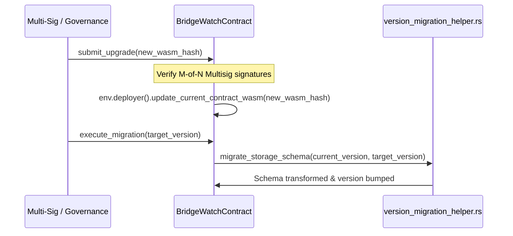

# Soroban Smart Contract Architecture Overview

This document describes the architectural topology, module design, data storage layout, upgrade strategies, and external integrations for the Stellar Bridge-Watch smart contracts implemented in Soroban (`contracts/soroban/src/`).

---

## 1. System Architecture & Contract Relationships

The Bridge-Watch on-chain system provides real-time security telemetry, reserve verification, automated circuit breakers, rate limiting, and governance mechanisms for Stellar cross-chain bridges.

```mermaid
graph TD
    User([External Client / Bridge Operator]) -->|Invokes / Queries| Core[BridgeWatchContract (lib.rs)]
    
    subgraph Core Security & Access Control
        Core --> ACL[acl.rs]
        Core --> Multisig[emergency_multisig.rs]
        Core --> OperatorRot[operator_rotation.rs]
        Core --> RateLimit[rate_limiter.rs]
        Core --> CircuitBreaker[circuit_breaker.rs]
    end

    subgraph Verification & Oracle Engine
        Core --> OracleHub[oracle_hub.rs]
        Core --> ReserveVerifier[bridge_reserve_verifier.rs]
        Core --> ZkVerifier[zk_verifier.rs]
        Core --> MMRAccum[mmr_accumulator.rs]
        Core --> SourceTrust[source_trust.rs]
    end

    subgraph Asset & Protocol Governance
        Core --> AssetReg[asset_registry.rs]
        Core --> Governance[governance.rs]
        Core --> InsurancePool[insurance_pool.rs]
        Core --> LiquidityPool[liquidity_pool.rs]
        Core --> Escrow[escrow_contract.rs]
    end

    subgraph Analytics & Telemetry Rollup
        Core --> Analytics[analytics_aggregator.rs]
        Core --> AlertSys[alert_system.rs]
        Core --> RollupFlush[rollup_flush.rs]
        Core --> StateExport[state_export.rs]
    end
```

---

## 2. Module Specifications (38 Modules)

1. **`acl.rs`**: Implements fine-grained Role-Based Access Control (RBAC) supporting granular permission grants (`Permission`), administrative roles (`Role`), and emergency overrides for operator accounts.
2. **`alert_system.rs`**: Manages on-chain alert emission, severity scoring (P0–P4), alert rule condition evaluations, and historical dispatch records for bridge events.
3. **`analytics_aggregator.rs`**: Computes running statistical summaries, rolling transaction volume windows, and health aggregates across monitored bridge assets.
4. **`asset_deprecation.rs`**: Coordinates the phased retirement and sunsetting lifecycle of legacy bridge tokens with time-locked grace periods and migration rules.
5. **`asset_ranking.rs`**: Scores and ranks supported bridge assets based on liquidity depth, price stability indices, and transaction frequency.
6. **`asset_registry.rs`**: Maintains authoritative asset metadata, status flags (Active, Paused, Deprecated), issuer public keys, decimal precision, and symbol associations.
7. **`batch_query.rs`**: Provides high-throughput vector queries enabling indexers and client SDKs to retrieve multi-asset statuses in a single atomic invocation.
8. **`bridge_asset_metadata.rs`**: Stores cross-chain mapping definitions, wrapped asset contract IDs, and native token issuance references.
9. **`bridge_reserve_verifier.rs`**: Validates off-chain and cross-chain reserve balance attestations against on-chain token supplies to detect under-collateralization.
10. **`circuit_breaker.rs`**: Executes automated and manual pause actions across global, bridge, or asset scopes when volatility or anomaly thresholds are exceeded.
11. **`emergency_fund_recovery.rs`**: Facilitates secure multi-signatory emergency asset transfers from compromised vault contracts to verified recovery treasuries.
12. **`emergency_multisig.rs`**: Enforces threshold (M-of-N) cryptographic signature schemes on critical administrative operations, pause toggles, and state upgrades.
13. **`escrow_contract.rs`**: Implements conditional time-locked asset holds, settlement release triggers, refund mechanics, and dispute arbitration channels.
14. **`event_query.rs`**: Exposes structured search and filtered query interfaces for historical contract events, topic filters, and emission logs.
15. **`fee_distribution.rs`**: Handles protocol fee calculations, validator staking reward distributions, and treasury revenue allocation splits.
16. **`governance.rs`**: Powers decentralized proposal submissions, voting power calculations, timelock queues, and execution of on-chain protocol parameter upgrades.
17. **`insurance_pool.rs`**: Manages liquidity backstop reserves, underwriter deposit accounting, and automated claim disbursement workflows in the event of bridge shortfalls.
18. **`liquidity_pool.rs`**: Provides automated market maker (AMM) liquidity mechanics, Time-Weighted Average Price (TWAP) tracking, and impermanent loss monitoring.
19. **`migration.rs`**: Provides low-level contract storage schema version transformers and key-space migration scripts.
20. **`mmr_accumulator.rs`**: Implements a Merkle Mountain Range (MMR) accumulator for efficient append-only transaction inclusion proofs and checkpoint commitments.
21. **`multisig_treasury.rs`**: Manages protocol capital reserves requiring multi-operator consensus for expenditures, grants, and operational payouts.
22. **`operator_rotation.rs`**: Handles cryptographic public key rotation for validator guardians across distinct epoch cycles with transition overlap windows.
23. **`oracle_hub.rs`**: Ingests, normalizes, and medianizes multi-source external price and exchange rate feeds while filtering outliers and stale timestamps.
24. **`rate_limiter.rs`**: Enforces sliding-window and token-bucket velocity constraints on bridge asset transfer volumes to mitigate rapid liquidity draining.
25. **`relay`**: Coordinates cross-chain message envelope verification, payload validation, and dispatch acknowledgments between external networks and Stellar.
26. **`report_hash.rs`**: Computes and anchors canonical cryptographic hashes of off-chain observer node reports for audit trail immutability.
27. **`reputation_system.rs`**: Tracks node operator uptime, validator attestation accuracy, slashing penalties, and historical reliability scores.
28. **`rollup_flush.rs`**: Flushes batched off-chain telemetry states and Merkle roots to persistent on-chain storage at periodic ledger intervals.
29. **`sidecar_state.rs`**: Monitors liveness, heartbeats, and synchronization offsets of decentralized observer sidecar nodes.
30. **`source_blessing.rs`**: Maintains the registry of blessed data sources and cryptographic oracle signers authorized to post telemetry.
31. **`source_priority.rs`**: Configures hierarchical failover priority orders among redundant data ingestion feeds and fallback endpoints.
32. **`source_trust.rs`**: Allocates dynamic trust tiers and reliability weighting parameters across decentralized oracle providers.
33. **`state_export.rs`**: Serializes full contract state snapshots into compact binary representations for off-chain auditing and replication.
34. **`submission_pause.rs`**: Provides fine-grained pause controls targeting incoming bridge deposit and withdrawal transaction submissions.
35. **`submission_replay.rs`**: Protects against replay attacks by tracking transaction nonces, message digests, and execution status bitmasks.
36. **`threshold_window.rs`**: Evaluates sliding-window aggregate metrics against configurable anomaly threshold bands.
37. **`version_migration_helper.rs`**: Facilitates backward-compatible struct deserialization and automated in-flight data upgrades during version increments.
38. **`zk_verifier.rs`**: Executes zero-knowledge proof verification (such as Groth16 and Plonk over BN254/BLS12-381 curves) for privacy-preserving reserve balance attestations.

---

## 3. Storage Key Layout & Data Model

Soroban smart contracts utilize typed data keys stored in `Instance`, `Persistent`, and `Temporary` storage domains.

### Data Key Enumerations
```rust
#[contracttype]
#[derive(Clone, Debug, Eq, PartialEq)]
pub enum DataKey {
    // Access Control & Identity
    Admin,
    Operator(Address),
    RoleGrant(Address, Role),
    
    // Asset & Bridge State
    AssetConfig(String),
    AssetHealth(String),
    BridgeStatus(String),
    CircuitPause(PauseScope, String),
    
    // Rate Limiting & Volumes
    RateLimitBucket(String, u64),
    
    // Verifiers & Proofs
    ZkVerificationKey(String),
    MmrRoot(u64),
    
    // Protocol Configuration
    ConfigVersion,
    ProtocolFeeBps,
}
```

### Storage Domain Strategy
- **Instance Storage**: Contract configuration, admin keys, active circuit breaker flags, and protocol parameters.
- **Persistent Storage**: Asset health records, operator lists, historical proof commitments, and governance proposals.
- **Temporary Storage**: High-frequency sliding rate limit counters and short-lived nonce validity windows with automated TTL expiration.

---

## 4. Upgrade & Migration Strategy

Soroban allows contract executables (WASM bytecode) to be updated in place without altering the deployed contract ID.



1. **WASM Deployment**: New contract code is compiled and installed on-chain via `stellar contract install`, producing a cryptographic WASM hash.
2. **Multisig Authorization**: Emergency multisig or governance proposal approves the new WASM hash.
3. **Executable Update**: Contract calls `env.deployer().update_current_contract_wasm(new_wasm_hash)`.
4. **State Schema Transformation**: The `version_migration_helper` iterates and upgrades any modified storage keys or structs to maintain strict binary compatibility.

---

## 5. External Dependencies

- **SEP-41 Token Interface**: Standard Stellar Asset Contract (SAC) interfaces for asset transfers, balances, and escrow locks.
- **Decentralized Oracles**: External price and exchange feeds (e.g. Band, Pyth, Reflector) conforming to standard ScVal pricing tuples.
- **SEP-38 Quote Interface**: Cross-asset conversion calculations and slippage verification.
- **Cryptographic Verification Libraries**: `ed25519-dalek` and zero-knowledge pairing curve implementations for proof verification.
