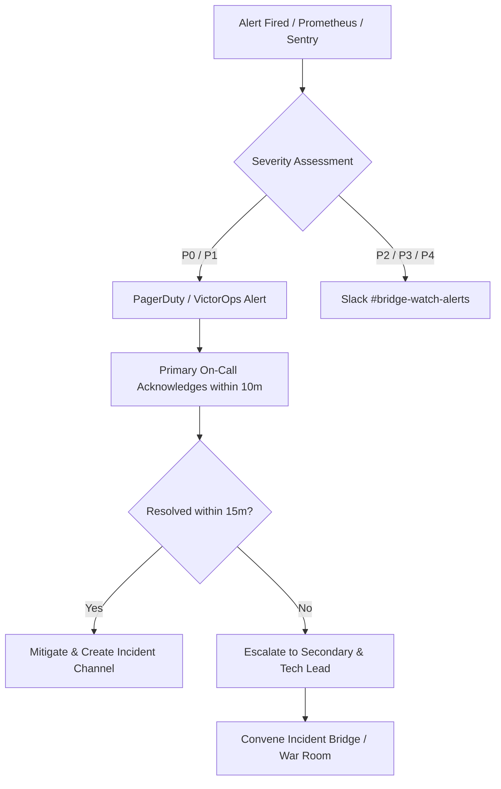

# Bridge-Watch Incident Response Runbook

This runbook outlines operational response procedures, severity classifications, escalation workflows, emergency circuit breaker procedures, communication templates, and post-incident review checklists for the Stellar Bridge-Watch monitoring infrastructure.

---

## 1. Incident Severity Classification (P0 - P4)

Incidents are classified based on operational impact, threat to bridged collateral, oracle integrity, and user safety.

| Severity | Definition | Impact Examples | Response SLA | On-Call Engagement |
| :--- | :--- | :--- | :--- | :--- |
| **P0 - Critical** | Catastrophic failure, active exploit, or imminent loss of bridge collateral. | • On-chain reserve discrepancy > 5%<br>• Consensus halt or relayer corruption<br>• Private key compromise | **< 10 minutes** | Immediate page to Primary On-Call, Lead Architect, Security Team, and Executive Sponsor. |
| **P1 - Major** | Core monitoring or bridge function impaired with active risk. | • Circuit breaker tripped across bridge<br>• Stalled oracle ingestion (>10 ledgers)<br>• False emergency pause event | **< 30 minutes** | Primary On-Call, Secondary On-Call, Engineering Lead. |
| **P2 - Moderate** | Partial redundancy failure or degraded performance without fund risk. | • High RPC latency (>2000ms)<br>• Secondary telemetry node out of sync<br>• Alert delivery queue backlog | **< 2 hours** | Primary On-Call during business hours / next shift. |
| **P3 - Minor** | Minor bug, telemetry anomaly, or non-critical worker restart. | • UI dashboard visual rendering defect<br>• Single retryable indexer failure<br>• Non-blocking logging pipeline delay | **< 8 hours** | Standard ticketing queue. |
| **P4 - Low / Informational** | Cosmetic defect or routine maintenance inquiry. | • Documentation typo<br>• Non-critical metric label mismatch | Next Sprint | Standard sprint backlog. |

---

## 2. Escalation Paths & On-Call Procedures



### Roles and Responsibilities
- **Incident Commander (IC)**: Leads triage, delegates investigations, approves mitigation steps, and prevents duplicate work.
- **Operations Lead**: Executes on-chain transactions, pauses circuit breakers, and manages infrastructure components.
- **Communications Lead**: Prepares external bridge stakeholder notices and updates status dashboards.
- **Scribe**: Records all timestamps, command outputs, hypotheses, and actions in the designated incident ticket.

---

## 3. Circuit Breaker Emergency Trigger & Reset Procedures

The Bridge-Watch on-chain and off-chain circuit breaker mechanisms protect bridge assets by suspending bridge transactions upon anomaly detection.

### 3.1 Triggering an Emergency Pause

Emergency pause operations can be triggered via the CLI or the administrative API.

#### Via Admin API
```bash
curl -X POST https://api.bridgewatch.stellar.org/api/v1/circuit-breaker/pause \
  -H "Content-Type: application/json" \
  -H "x-api-key: $ADMIN_API_KEY" \
  -d '{
    "scope": "bridge",
    "identifier": "stellar-ethereum-vault-01",
    "reason": "Unusual reserve outflow detected at ledger 5439120"
  }'
```

#### Via Soroban Contract CLI (Direct On-Chain Emergency Multisig)
```bash
soroban contract invoke \
  --id $BRIDGE_WATCH_CONTRACT_ID \
  --source $OPERATOR_KEY \
  --network mainnet \
  -- emergency_pause \
  --scope "bridge" \
  --identifier "stellar-ethereum-vault-01" \
  --reason "Anomaly threshold exceeded"
```

### 3.2 Verification of Pause State
```bash
curl -X GET "https://api.bridgewatch.stellar.org/api/v1/circuit-breaker/status?scope=bridge&identifier=stellar-ethereum-vault-01"
```
Expected Response:
```json
{
  "paused": true,
  "scope": "bridge",
  "identifier": "stellar-ethereum-vault-01"
}
```

### 3.3 Recovery & Reset Procedure

Unpausing requires quorum verification by multiple guardian signatures:
1. Verify reserve balance matches on-chain collateral proofs across target chains.
2. Confirm oracle pricing feeds are live and within standard deviation limits.
3. Submit the recovery transaction:

```bash
curl -X POST https://api.bridgewatch.stellar.org/api/v1/circuit-breaker/recovery \
  -H "Content-Type: application/json" \
  -H "x-api-key: $ADMIN_API_KEY" \
  -d '{
    "pauseId": 1042
  }'
```

---

## 4. Communication Templates

### P0 Communication Template (Critical)
```markdown
[INCIDENT ACKNOWLEDGMENT - P0]
Status: Investigating
Service Affected: Bridge Collateral / Relayer Network
Impact: Deposits and withdrawals temporarily suspended via circuit breaker.

Summary:
We have detected an anomaly regarding [brief description] on [Bridge/Asset Name].
The automated circuit breaker has paused bridge operations to safeguard funds.
No fund loss has occurred / Investigation is actively ongoing.

Next Update: Within 30 minutes.
Status Dashboard: https://status.bridgewatch.stellar.org
```

### P1 Communication Template (Major)
```markdown
[INCIDENT STATUS UPDATE - P1]
Status: Identified / Mitigating
Service Affected: Oracle Price Feeds / Event Indexer
Impact: Event notification delays of approximately 10-15 minutes. On-chain bridge transfers remain secure.

Summary:
The engineering team has identified [Root Cause] causing telemetry indexing delays.
Mitigation steps are currently being deployed to secondary RPC endpoints.

Next Update: Within 45 minutes.
```

### Incident Resolution Template (All Severities)
```markdown
[INCIDENT RESOLVED]
Service: [Affected Component]
Incident Duration: [Start Time UTC] - [End Time UTC]

Resolution Summary:
The issue affecting [Component] has been fully resolved. All health checks, 
circuit breaker metrics, and telemetry queues have returned to normal operating parameters.
A comprehensive Post-Incident Review (PIR) will be published within 48 hours.
```

---

## 5. Post-Incident Review (PIR) Checklist

All P0, P1, and recurring P2 incidents require a Post-Incident Review meeting within 48 hours of resolution.

- [ ] **Timeline Reconstruction**: Exact ledger sequences, alert triggers, response actions, and recovery timestamps verified against log telemetry.
- [ ] **5 Whys Root Cause Analysis**: Root cause traced back beyond immediate technical trigger to process, monitoring, or architectural vulnerabilities.
- [ ] **Impact Quantification**: Exact ledger count, affected transactions, gas overhead, or downtime duration documented.
- [ ] **Circuit Breaker Performance**: Evaluate if automatic circuit breakers tripped within expected latency thresholds.
- [ ] **Action Items & Tracking**: Preventative engineering tasks created with assigned owners and target delivery dates in Jira/GitHub Issues.
- [ ] **Documentation Updates**: Update runbooks, architectural documents, and alert threshold configs to reflect lessons learned.
